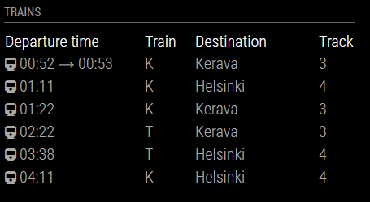

# Module for [MagicMirror](https://magicmirror.builders/): Timetable for Digitraffic data (Finland)

The `mm-digitraffic-trains` module fetches train timetable data from Digitraffic api (Finland) and shows the timetables for configured stations.

You will need to check the `stationShortCode` from https://rata.digitraffic.fi/api/v1/metadata/stations and add the code of the station you want to show in the config station string.

## Screenshot

- Digitransit trains screenshot



## Using the module

1) Clone this repository under `MagicMirror/modules` folder
2) Add to the modules array in the `MagicMirror/config/config.js` file:
````javascript
modules: [{
	module: "mm-digitraffic-trains",
	position: "top_right",
	header: "Trains",
	config: {
		icon: "train", // See: https://fontawesome.com/icons?d=gallery
		showIcon: true,
		station : "KRS", // See: https://rata.digitraffic.fi/api/v1/metadata/stations
		updateInterval: 2500,
		trainCount: 6,
		showOnlyDestinations: ['Helsinki'] // If defined, shows only trains what destination is defined station(s). Increase also trainCount if defined.
	}
}]
````

## Configuration options

The following properties can be configured:


| Option                       | Description
| ---------------------------- | -----------
| `icon`                       | Showed icon style class, default `train`. See others: https://fontawesome.com/icons?d=gallery
| `showIcon`                   | Show icon or not, default `true`
| `station`                    | Station short code, default `KRS`. See others: https://rata.digitraffic.fi/api/v1/metadata/stations
| `updateInterval`             | Update interval in milliseconds, default `2500`
| `trainCount`				   | Showed departing trains count, default `6`
